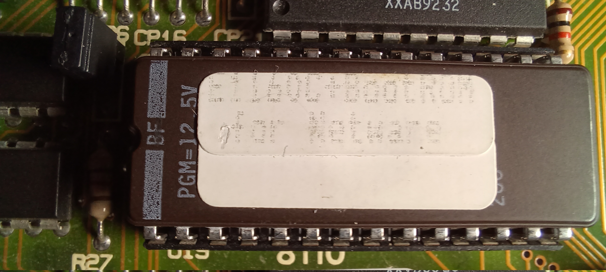
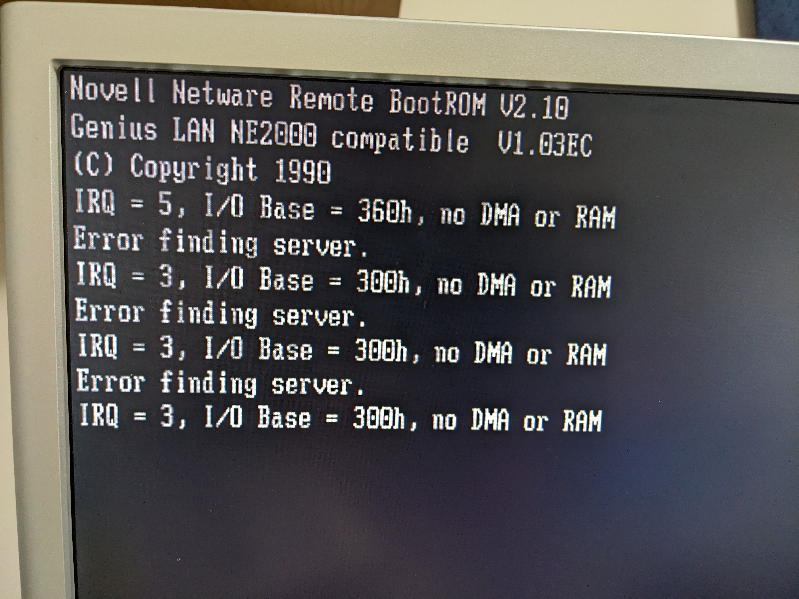
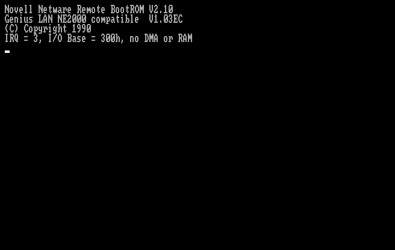
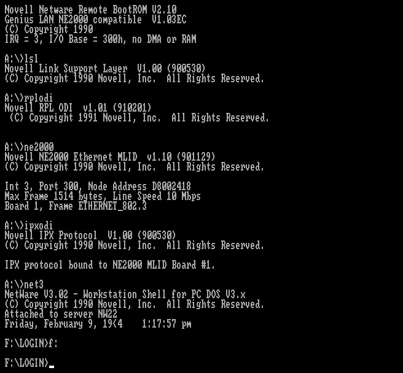

# E1160C+BootROM for Netware

This archive contains a dump of a NetWare IPX boot ROM for an
NE2000-compatible ISA Ethernet card.  The ROM chip is labeled as follows:

    E1160C+BootROM
     for Netware

The ROM identifies itself as follows:

    Novell Netware Remote BootROM V2.10
    Genius LAN NE2000 compatible  V1.03EC
    (C) Copyright 1990

The card it was obtained from is labeled "E-1160C V2.2A".

# File information

* File: [E1160C\_Netware\_93083785.rom](E1160C_Netware_93083785.rom)
* Size:   8192 bytes
* CRC32:  93083785
* MD5:    f67d1e365f6bf326981badf2aff763b7
* SHA1:   52ec13085cc28591381cb56881c9be26c13795b3
* SHA256: 18c17c12cfea8afe7740ae2b531cb626ecad654251b33f61a5d25dceb33115e2

# I/O port and IRQ configuration

The boot ROM supports at least the following IO/IRQ combinations:

| IOport range | IRQ  |
|--------------|------|
| 300h - 31Fh  | 3    |
| 320h - 33Fh  | 2    |
| 340h - 35Fh  | 4    |
| 360h - 37Fh  | 5    |

# Compatibility

On the [86Box PC emulator](https://86box.net/), I was able to use this
bootrom to perform diskless booting of DOS from a NetWare 2.2 server using
an emulated NE2000 network card.  This used plain Netware IPX, not newer
protocols like Novell RPL or PXE, so this ROM should also work with older
versions of Netware 286.

I successfully booted MSDOS 3.31 and 4.01 using this ROM.

**I was _not_ able to boot DOS 5.0 or later.**

# Server-side configuration: BOOTCONF.SYS

The ROM looks for the nearest NetWare server over IPX (IEEE 802.3 mode) and
attempts to fetch `SYS:LOGIN\BOOTCONF.SYS` from it.  The file is parsed as
described in
["How Novell's BootROM works"](https://www.fuw.edu.pl/~jt/net-boot-old.html)
and
[this zxnet article](https://www.zx.net.nz/netware/client/dos-netboot/bootware.shtml),
with the following similarities/differences:

- It doesn't support wildcards ('?')

- It doesn't explicitly support comments.  It treats first 12
  non-whitespace characters after the '=' sign as the filename.  So for the
  example (below) from the zxnet article, the bootrom attempts to load a
  file called "bootimg.syst":

      0x46FA55AA,0000C05707F0=bootimg.sys This is a comment

  A workaround is to ensure that all boot-image filenames use the full 8.3
  characters, e.g. by using "bootimg_.sys" instead of "bootimg.sys".

- If it can't find an image via bootconf.sys, the boot ROM falls back to
  `NET$DOS.SYS` or `IBM$DOS.SYS`, in that order.

# Photos and screenshots

